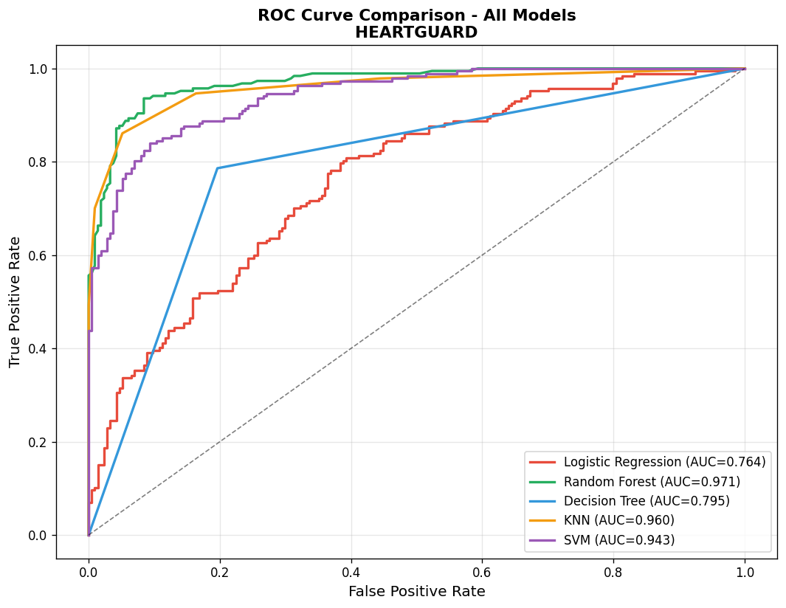
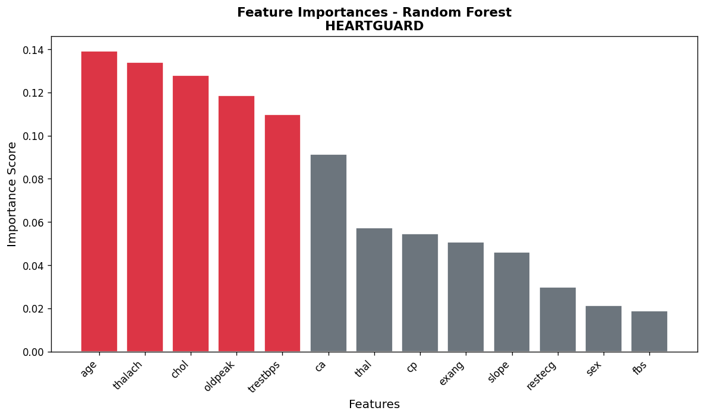
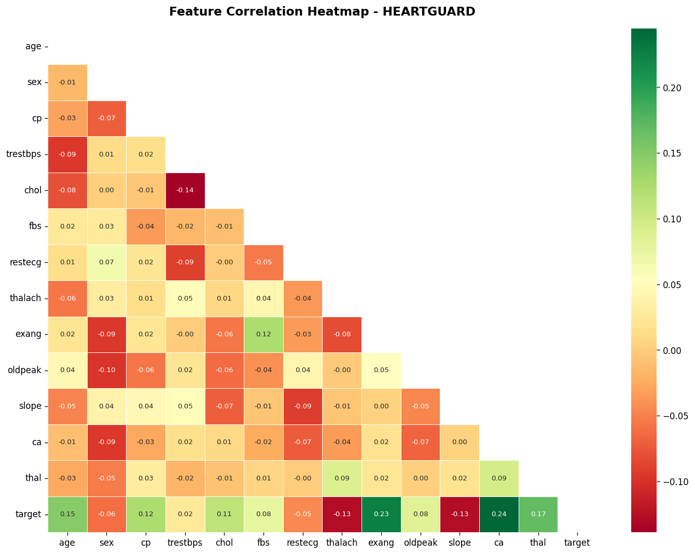

# HeartGuard

HeartGuard is a Streamlit-based machine learning app for heart disease risk prediction. It takes 13 clinical inputs, runs them through a trained Random Forest model, and presents a clear risk assessment with confidence, contributing factors, and supporting analytics.

## Live Demo

[Open the deployed Streamlit app](https://heartguard-app-app.streamlit.app/)

## Overview

- Predicts heart disease risk from patient clinical data
- Uses a tuned Random Forest classifier as the deployed model
- Shows confidence, risk category, and top contributing features
- Includes dataset insights, EDA visuals, ROC curves, and model comparison
- Built as an academic and demonstration project for clinical decision support workflows

## Model Snapshot

- Dataset: UCI Cleveland Heart Disease Dataset
- Records: 2003
- Input features: 13
- Accuracy: 92.8%
- Precision: 92.0%
- Recall: 92.5%
- ROC-AUC: 0.971

## Application Pages

- `Home`: project summary, model performance, and feature overview
- `Predict`: patient form with real-time risk prediction
- `Analytics & EDA`: dataset summary, plots, correlations, and model comparison
- `About`: project background, tech stack, and disclaimer

## Screenshots

### Model Comparison



### Feature Importance



### Correlation Heatmap



## Tech Stack

- Python
- Streamlit
- scikit-learn
- pandas
- numpy
- matplotlib
- seaborn
- joblib

## Project Structure

```text
heartguard_streamlit/
|-- app.py
|-- requirements.txt
|-- heart.csv
|-- DEPLOY.md
|-- models/
|   |-- heartguard_model.pkl
|   |-- scaler.pkl
|   |-- feature_names.pkl
|   |-- importances.pkl
|   |-- importance_labels.pkl
|   `-- model_metrics.json
|-- static/
|   `-- img/
`-- .streamlit/
    `-- config.toml
```

## Run Locally

1. Create a virtual environment.

```bash
python -m venv .venv
```

2. Activate the environment.

```bash
# Windows
.venv\Scripts\activate

# macOS / Linux
source .venv/bin/activate
```

3. Install dependencies.

```bash
pip install -r requirements.txt
```

4. Start the Streamlit app.

```bash
streamlit run app.py
```

5. Open the local URL shown by Streamlit, usually `http://localhost:8501`.

## Deployment

Deployment instructions for GitHub and Streamlit Community Cloud are available in [DEPLOY.md](DEPLOY.md).

## Repository Notes

- The trained model file in `models/heartguard_model.pkl` is small enough for normal GitHub storage.
- `.streamlit/config.toml` is included because it contains safe UI and server settings.
- `.streamlit/secrets.toml` is intentionally ignored and should never be committed.

## Disclaimer

HeartGuard is a research and educational project. It is not a certified medical device and should not be used as a substitute for professional medical diagnosis or treatment.
